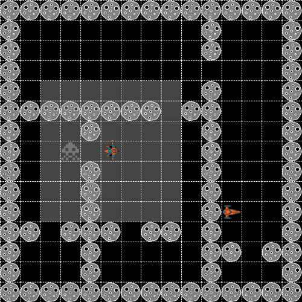

# API Documentation

Players are simple REST APIs with **two endpoints**:

* **`/name`**: should provide basic information on a player.
See [Name Endpoint](#name-endpoint) for more information.

* **`/move`**: will receive map information, and needs to reply with the next move for the player.
See the [Move Endpoint](#move-endpoint) for more information.

## Name Endpoint

Your `/name` URL API will receive a **POST** request without body.
Reply with JSON format indicating the **name** of the player or team and the contact **email**.

### Request format

```
POST /name HTTP/1.1
Host: your-api.com
```

### Response format

```
HTTP/1.1 200 OK

{
    "name": string,        // The player or team name
    "email": string        // The contact email
}
```

## Move Endpoint

Your `/move` URL API will receive a POST request with the information about the visible part of the map in JSON format, and you need to reply with the next movement also in JSON format.
See [visible area](#visible-area) section for more information.

### Request format

```
POST /move HTTP/1.1
Host: your-api.com

{
    "game": {                  // Object - game data
        "id": uuid             // Unified unique ID of the game
    },
    "player": {                // Object - player data
        "id": uuid,            // Unified unique ID of the player
        "name": string,        // The name of the player
        "position": {          // Object - current position of the player
            "y": int,
            "x": int
        },
        "previous": {          // Object - previous positions of the player
            "y": int,
            "x": int
        },
        "area": {              // Object - visible area for the player
            "y1": int,
            "x1": int,
            "y2": int,
            "x2": int
        },
        "fire ": "bool"        // If the player can fire this round
    },
    "board": {                 // Object - board data
        "size": {              // Object - Total size of the maze
            "height": int,
            "width": int
        },
        "walls": [             // Array - visible walls
            {                  // Object - wall position
                "y": int,
                "x": int
            },
        ]
    },
    "players": [               // Array - other players positions
        {                      // Object - other players position
            "y": int,
            "x": int
        }
    ],
    "invaders": [              // Array - invaders positions
        {                      // Object - invader position
            "y": int,
            "x": int,
            "neutral": "bool"  // If the invader can be killed by touching
        }
    ]
}
```

### Response format

```
HTTP/1.1 200 OK

{
    "move": string         // up, down, left or right, fire-up, fire-down, fire-right or fire-left
}
```

## Visible area



The board is a 0-based matrix, where [0, 0] is the upper left corner.
The height and width are sent in the `board.size.height` and `board.size.width` vars of the request body in the [Move endpoint](#move-endpoint).

Each player has its own **visible area** based on its current position.
The visible area is sent in the `player.area` var which is an object with four vars `y1`, `x1`, `y2` and `x2`.

The information sent in `board.walls`, `invaders` and `players` vars depends on the **visible area**.

The **fire range** also depends on the visible area.
You can shot at any straight direction (up, down, left or right) and the fire range is limited to what you can see.

## Examples

### Example of request

```
POST /move HTTP/1.1
Host: your-api.com

{
    "game": {
        "id": "78df6fe1-4ba4-408a-ab99-b7122967214f"
    },
    "player": {
        "id": "78df6fe1-4ba4-408a-ab99-b7122967214f",
        "name": "Test player",
        "position": {
            "y": 3,
            "x": 4
        },
        "previous": {
            "y": 2,
            "x": 4
        },
        "area": {
            "y1": 0,
            "x1": 0,
            "y2": 8,
            "x2": 9
        },
        "fire": false
    },
    "board": {
        "size": {
            "height": 15,
            "width": 15
        },
        "walls": [ {
            "y": 0,
            "x": 1
        }, {
            "y": 0,
            "x": 2
        }, {
            "y": 0,
            "x": 3
        }, {
            "y": 0,
            "x": 4
        }, {
            "y": 0,
            "x": 5
        }, {
            "y": 0,
            "x": 6
        }, {
            "y": 0,
            "x": 7
        }, {
            "y": 0,
            "x": 8
        }, {
            "y": 0,
            "x": 9
        }, {
            "y": 1,
            "x": 0
        }, {
            "y": 2,
            "x": 0
        }, {
            "y": 3,
            "x": 0
        }, {
            "y": 4,
            "x": 0
        }, {
            "y": 5,
            "x": 0
        }, {
            "y": 5,
            "x": 1
        }, {
            "y": 5,
            "x": 2
        }, {
            "y": 5,
            "x": 3
        }, {
            "y": 5,
            "x": 4
        }, {
            "y": 5,
            "x": 5
        }, {
            "y": 5,
            "x": 6
        }, {
            "y": 5,
            "x": 7
        }, {
            "y": 5,
            "x": 9
        }, {
            "y": 6,
            "x": 0
        }, {
            "y": 6,
            "x": 4
        }, {
            "y": 7,
            "x": 0
        }, {
            "y": 8,
            "x": 0
        }, {
            "y": 8,
            "x": 4
        } ]
    },
    "players": [ {
        "y": 1,
        "x": 1
    } ],
    "invaders": [ {
        "y": 2,
        "x": 2,
        "neutral": false
    }, {
        "y": 8,
        "x": 3,
        "neutral": true
    } ]
}
```

### Example of response

```
HTTP/1.1 200 OK

{
    "move": "fire-up"
}
```
