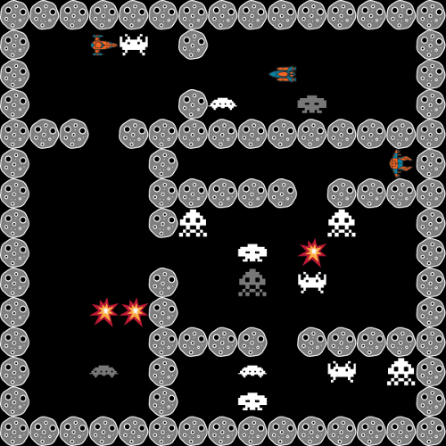
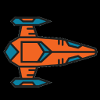
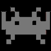

# Rules for the Code Challenge 2018

The idea is quite simple:
You have to **create a REST API** to **move a starship** across a random generated board.
In this board there are also a number of **space invaders** and the other players' starships.
You could **move** or **fire** at any direction (up, down, left or right), but you will have limited shots.

You will know the size of the board, the position of your character and some other data, but you won't see the entire board.
The game engine will call your API, sending the current conditions, and your API will have to response with your next move:
`up`, `down`, `left`, `right`, `fire-up`, `fire-down`, `fire-left` or `fire-right`.

## The game

The Player's Starship is the character moved by the [player's REST API](api.md).
The game engine can manage up to 8 different starships concurrently.

The Space Invaders will kill a you if they catch you.
The invaders move randomly across the board.
The number of invaders in the game and the spawn frequency can be configured and it changes from game to game.

When a new space invader is born, he is neutral for some movements.
A neutral invader cannot kill a player, but players can kill neutral space invaders by touching them.
After a few movements a neutral invader becomes a regular space invader.

When a player is killed, he explodes.
A killed player will remain dead for some movements and then he respawns in the same place where he was killed.

This is a shot.
A player fired.
If a shot hunts a player or an invader, it kills him.

The game engine processes all the **movements** from the players and then the **shots**.
So a player can dodge a shot.
When all the movements and the shots are processed the game engine moves the **invaders**.
So the invaders cannot dodge a shot.

The shots are instantaneous, but limited to the [**visible area**](api.md#visible-area).
If two players shot each other at the same time, the both die.
After shooing, a player must reload and he cannot shot again until after a few movements.

## Rules

### Basics

* The **Code Challenge 2018** is a programming competition.

* It's opened to **all Privalia employees** particularly those ones in the IT department.

* The required programming level to participate is high.

### Join

* To join the challenge you'll need to upload your API to your own Internet server.

* Your API has to be accessible from the game server through an URL or IP address.

* No support will be given to create the API or upload it to a server.

### Dates

* November 30th to December 13rd: Develop your API.

* December 14th at 13:00h: Competition at Privalia training room.

### Prizes

* A t-shirt for all participants.

* Three special prizes for the bests.

### Competition format

* The Competition format will depend on the number of participants.

* The idea is to do some semifinals to discard non-optimized APIs and then a big final.

* The game parameters (size of the board, number of invaders, etc) will be revealed the day of the competition.

See:

* [API Documentation](api.md)
* [README.md](../README.md)
